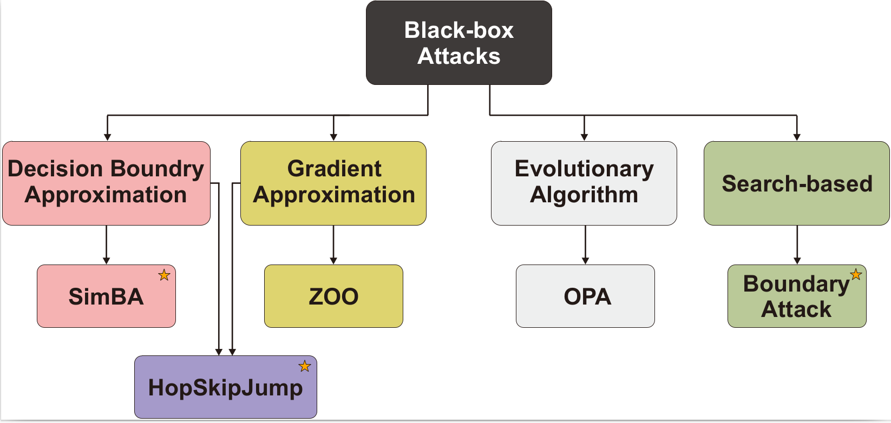



#  Comprehensive Evaluation of Adversarial Robustness in Deep Learning: Architecture, Diversity, and Defense Analysis

## Project Description

Adversarial attacks pose a serious challenge to the reliability and security of deep learning (DL) models. These attacks, often crafted by introducing imperceptible perturbations to input data, can cause models to make incorrect predictions with high confidence. As a result, understanding and mitigating such threats has become a critical area of research in the field of trustworthy AI.

Defenses against adversarial attacks range from input preprocessing and adversarial training to robust model design, yet no single approach has proven universally effective. At **InfoLab, Sungkyunkwan University (SKKU)**, our research group undertakes a systematic investigation into the effectiveness of various adversarial attacks and corresponding defense mechanisms, providing a comprehensive analysis of how deep learning models respond to different threat vectors across multiple architectures and datasets.

## Core Research Themes and Contributions

### 1. Multi-Dimensional Analysis of Adversarial Attacks and Defenses

Through large-scale experimentation, we investigated how factors such as model complexity, architectural diversity, and training datasets impact robustness against adversarial attacks. We evaluated several white-box and black-box attack methods (e.g., FGSM, PGD, C&W, SimBA, HopSkipJump, MGAAttack, and Boundary Attack) across popular model families (e.g., VGG, ResNet, DenseNet, MobileNet, Inception, Xception, ShuffleNet) and datasets (ImageNet, CIFAR-10, CIFAR-100). Key findings include:

- Deeper models (with more layers) tend to be more robust in general, requiring higher perturbation magnitudes and longer attack times.
- Model parameter count alone does not determine robustness; architecture design plays a more critical role.
- Black-box attacks become increasingly ineffective as model complexity grows, while simple preprocessing-based defenses (e.g., JPEG filtering, median smoothing) can reduce success rates significantly.

### 2. Impact of Architectural Variations on Robustness

We performed a controlled analysis on variations of popular DL architectures, including:

- **VGG models with and without Batch Normalization (BN):** Although BN improves accuracy, it may increase vulnerability to adversarial attacks by enabling gradient masking and reducing feature diversity.
- **Inception variants:** Inception ResNet V2 and Inception V4 showed increased resistance compared to Inception V3, due to architectural enhancements such as residual blocks and bottleneck modules.
- **MobileNet family:** MobileNet V3 (both small and large) offered better robustness than V2, credited to the integration of squeeze-and-excitation (SE) modules and hard-swish activations.

### 3. Behavior of Attacks Across Datasets and Defensive Strategies

We highlighted how dataset characteristics (e.g., resolution, number of classes) affect model behavior under attack. Notably:

- Attacks on models trained on high-resolution data required more sophisticated perturbations than those on low-resolution datasets.
- Models trained on datasets with more classes but smaller image sizes displayed inconsistent robustness patterns compared to other models.
- Preprocessing defenses, while simple, proved surprisingly effective against black-box attacks when tuned correctly.

## Project Objectives

- Provide an empirical foundation for understanding the robustness landscape of DL models against adversarial threats.
- Evaluate the impact of architectural decisions and model upgrades on adversarial vulnerability.
- Develop practical guidelines for deploying robust and defensible deep learning models in real-world environments.
- Investigate lightweight and efficient defense mechanisms that do not require architectural retraining.

## Research Impact

This project provides a **systematic and reproducible benchmark** for adversarial robustness analysis, offering insights for both researchers and practitioners seeking to deploy secure AI solutions. By exposing previously underexplored relationships between model design, training data, and adversarial behavior, **InfoLab at SKKU** is helping shape the future of trustworthy and resilient AI systems.
