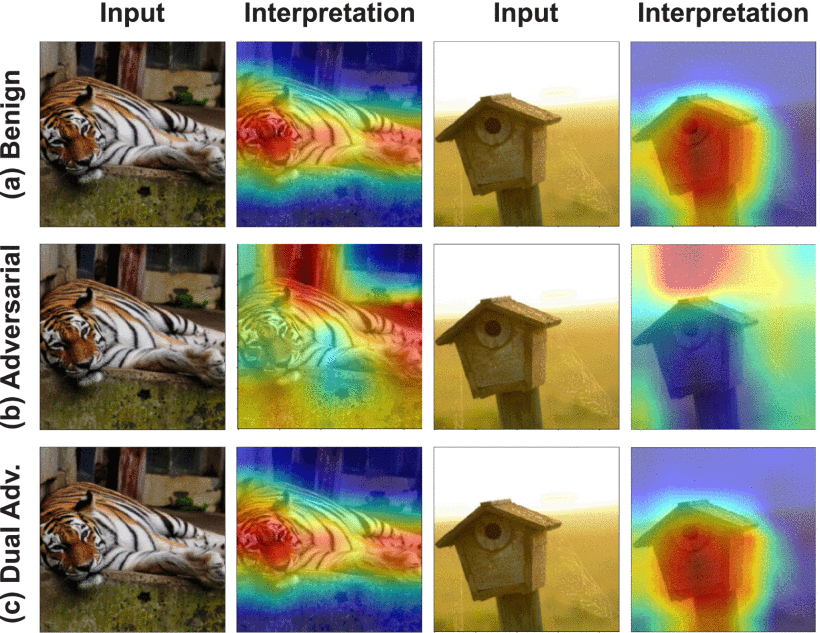
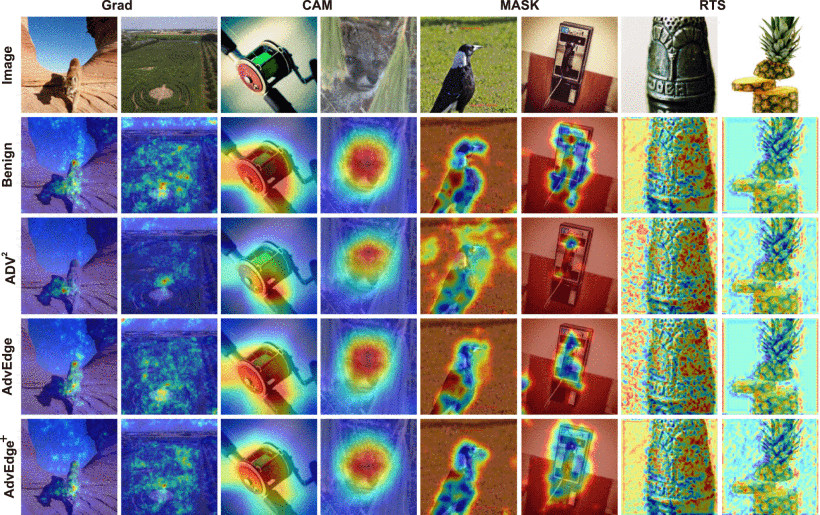



# Securing Interpretable Deep Learning Systems: Adversarial Threats, Stealthy Attacks, and Defense Mechanisms

## Project Description

The growing integration of deep learning (DL) models into high-stakes domains, such as healthcare, finance, and autonomous systems, has made interpretability a cornerstone of trustworthy AI. Interpretable Deep Learning Systems (IDLSes), which combine powerful neural networks with interpretation models, aim to provide transparency into the decision-making process. However, the assumption that interpretation inherently adds security has recently been challenged.

At **InfoLab, Sungkyunkwan University (SKKU)**, our research group has pioneered a comprehensive investigation into the security vulnerabilities of IDLSes, revealing how interpretation mechanisms themselves can be exploited by adversarial actors. Through a coordinated body of work encompassing three major research efforts, we have introduced novel attack techniques and analyzed defense strategies, reshaping the understanding of what it means for a deep learning system to be explainable and secure.

### Key Contributions from InfoLab, SKKU

#### **SingleADV: Single-Class Target-Specific Attack**

We introduced **SingleADV**, a universal perturbation-based adversarial attack that targets a specific object class, misclassifying it into a chosen target category. Crucially, SingleADV preserves interpretation maps that resemble benign ones, making it difficult for both automated systems and human observers to detect the manipulation. This attack works effectively in both white-box and black-box settings across multiple model and interpreter architectures.

#### **AdvEdge and AdvEdge+: Interpretation-Guided Stealthy Attacks**

These attacks exploit the edge-sensitive regions of input images, identified by interpretation maps, and inject subtle perturbations aligned with those areas. This strategy enhances stealth and minimizes detection, making the adversarial samples nearly indistinguishable from benign inputs. The methods have shown strong resilience and cross-model transferability, and can be applied across different datasets and interpreter types (e.g., CAM, Grad, MASK).

#### **QuScore: Stealthy Query-Efficient Opaque Attack**

Recognizing real-world black-box constraints, we developed **QuScore**, a query-efficient and model-agnostic attack tailored for black box settings, where internal model access is not available. Leveraging transfer-based strategies and a custom genetic algorithm, QuScore maintains interpretation fidelity while achieving over 95% attack success rate with a low query budget. It demonstrates that even limited feedback can be enough to compromise both prediction and interpretation.

## Project Objectives

- Systematically study and break the assumptions of interpretability-driven robustness in DL systems.
- Design category-specific, stealthy, and transferable adversarial attacks that target both prediction outputs and interpretation layers.
- Explore the vulnerabilities of IDLSes in real-world black-box and query-limited settings.
- Develop robust interpretation-aware defenses, including adversarial training and ensemble-based detection strategies.
- Provide open-source tools and benchmarks to facilitate future research in adversarial robustness and trustworthy AI.

## Research Impact

Our research at **InfoLab (SKKU)** reveals that interpretability is not inherently secure, and in fact, can serve as an attack surface when exploited thoughtfully. These findings are crucial for developers, regulators, and researchers designing DL systems in safety-critical environments. By unveiling these hidden threats and proposing initial defenses, we contribute toward building the next generation of resilient, trustworthy, and explainable AI systems.
